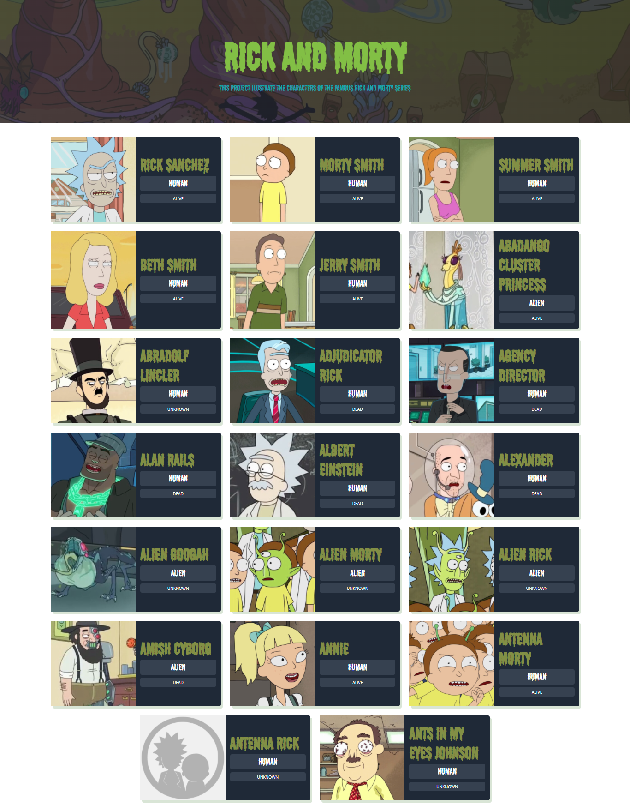
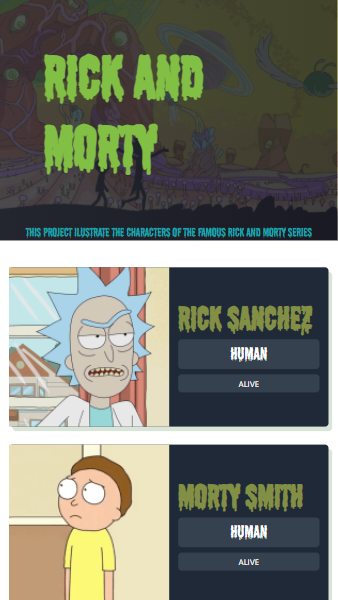

### You can view this page in this link:  https://alesamv.github.io/rickandmorty/
Web page that consumes the rick and morty API to show the characters of the series, using React and CSS to style the components.

And it is responsive:

# Getting Started with Create React App

This project was bootstrapped with [Create React App](https://github.com/facebook/create-react-app).

## Available Scripts

In the project directory, you can run:

### `yarn start`

Runs the app in the development mode.\
Open [http://localhost:3000](http://localhost:3000) to view it in the browser.

The page will reload if you make edits.\
You will also see any lint errors in the console.

